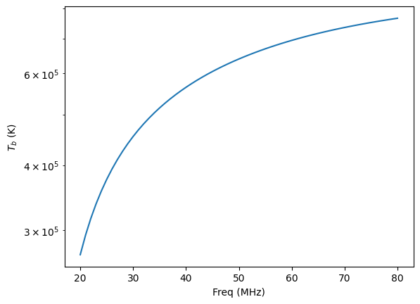

# TbSpectrum
Brightness temperature spectrum

paper: [https://arxiv.org/abs/2205.00065](https://arxiv.org/abs/2205.00065)

## Brightness temperature spectrum

Observation fitted model

|Freq (MHz)|Tb (K)|
|---|---|
|20.00|269037.89|
|21.00|293304.48|
|22.00|315895.97|
|23.00|336997.60|
|24.00|356767.05|
|25.00|375339.48|
|26.00|392831.54|
|27.00|409344.47|
|28.00|424966.65|
|29.00|439775.64|
|30.00|453839.80|
|31.00|467219.67|
|32.00|479969.09|
|33.00|492136.11|
|34.00|503763.78|
|35.00|514890.78|
|36.00|525552.02|
|37.00|535779.04|
|38.00|545600.45|
|39.00|555042.26|
|40.00|564128.15|
|41.00|572879.74|
|42.00|581316.77|
|43.00|589457.30|
|44.00|597317.85|
|45.00|604913.54|
|46.00|612258.21|
|47.00|619364.53|
|48.00|626244.07|
|49.00|632907.41|
|50.00|639364.22|
|51.00|645623.35|
|52.00|651692.91|
|53.00|657580.30|
|54.00|663292.37|
|55.00|668835.40|
|56.00|674215.23|
|57.00|679437.29|
|58.00|684506.69|
|59.00|689428.23|
|60.00|694206.48|
|61.00|698845.81|
|62.00|703350.41|
|63.00|707724.37|
|64.00|711971.64|
|65.00|716096.09|
|66.00|720101.52|
|67.00|723991.63|
|68.00|727770.10|
|69.00|731440.52|
|70.00|735006.44|
|71.00|738471.34|
|72.00|741838.64|
|73.00|745111.68|
|74.00|748293.74|
|75.00|751388.01|
|76.00|754397.61|
|77.00|757325.55|
|78.00|760174.75|
|79.00|762948.04|
|80.00|765648.11|
